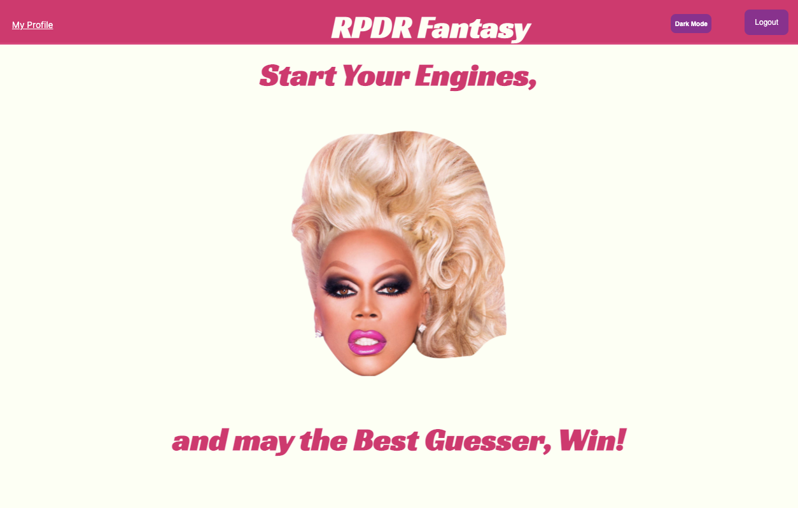
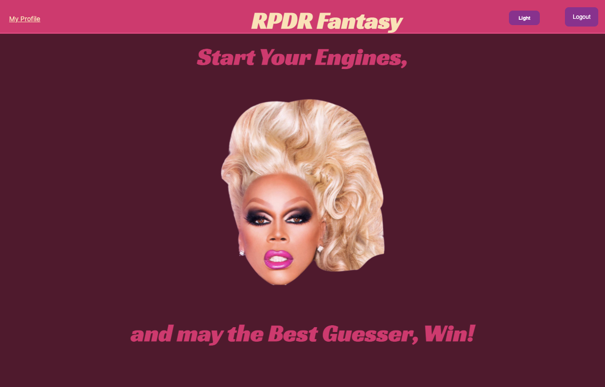
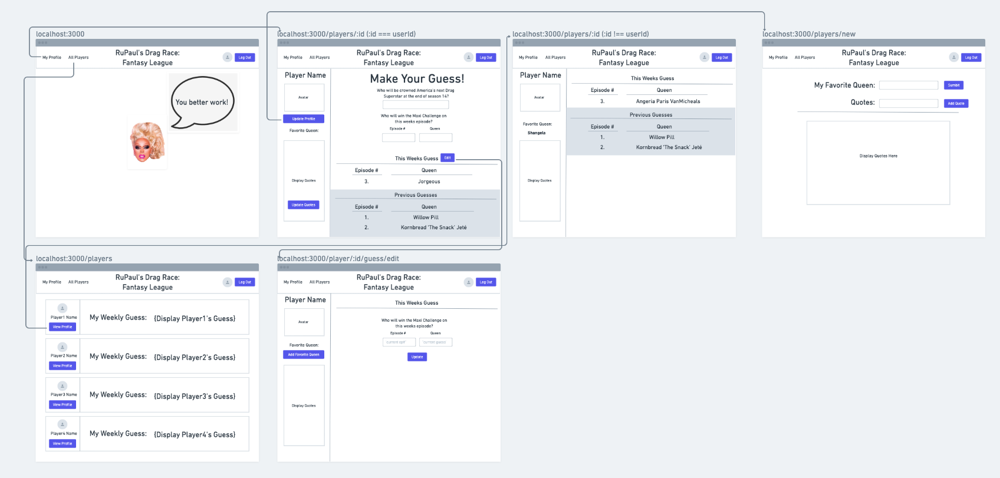

# RPDR Fantasy

## Deployed link
[Click Here!](https://rpdr-fantasy.herokuapp.com/)

## Objective
I'm a big fan of RuPaul's Drag Race (RPDR), and after years of watching I recently started playing in a fantasy league with some friends. In the fantasy league we guess which drag queen will win the Maxi Challenge for each episode, and get points each week depending on how that queen performs. We currently use a google spreadsheet to track everyone's guesses/points, and I thought it would be a fun project to try and make a web app that would mimic the fantasy league and automate the scoring system for us.

### Home Screen

Light Mode

Dark Mode

### Wireframe

My original wireframes:

## Technologies Used:

## Future Enhancements
- ~~Responsive Design~~
- ~~Dark Mode~~
- Scoring System
- Add a 'League' feature to allow groups of friends to play together
- Add photos of each queen to insert for Season Winner guess
- Automate guesses/scoring to sync with episode air dates

## Credits
The Queen herself 🙌 RuPaul🙌   - thank you for creating this amazing show! 
